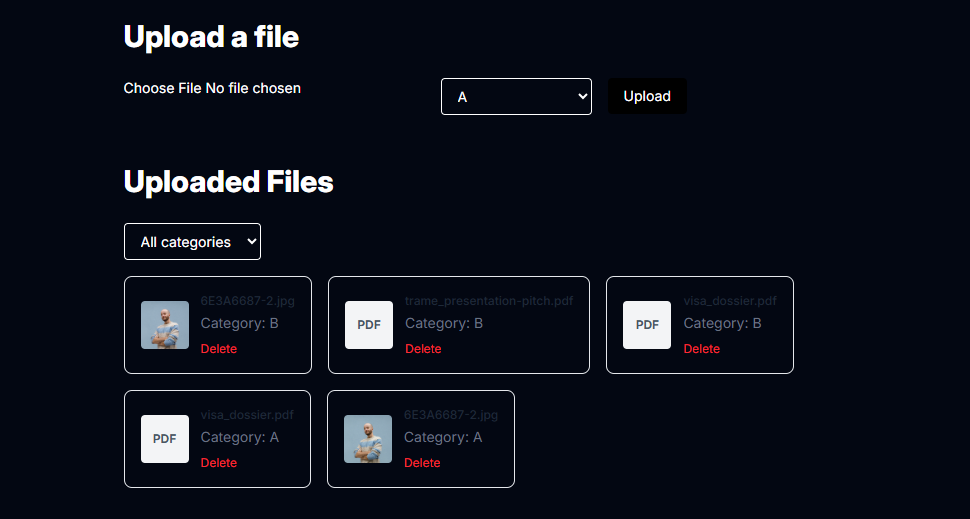

# Laravel-Remix file uploader

A simple file uploader with Laravel Remix



# Setup

## Docker setup (Recommended)

1. Build and start the containers:
   ```bash
   docker-compose up --build
   ```
2. The frontend will be available at `http://localhost:5173` and the backend at `http://localhost:8000`.

## Local setup

Reqs (my env):
- php 8.4+
- composer 2.9.2+
- npm 10+
- node 22+

### backend folder

````
composer i
cp .env.example .env
php artisan migrate
php artisan key:generate
php artisan storage:link
````
(sqlite as DB)

### frontend folder

````
npm i
cp .env.example .env
````

## Start hosting locally

### backend folder

````
php artisan serve
````
-> localhost:8000

### frontend folder

````
npm run dev 
````
-> localhost:5173

# Instructions to test the upload and delete features

1. go to http://localhost:5173/ in your browser
2. Click on the "Choose file" form input
3. Select a file to upload (pdf, jpg, png, <4mb)
4. Click on the "Upload" button
5. See the uploaded file in the list
6. Click on the "Delete" button next to the uploaded file
7. Confirm the deletion

Possible to filter by categories.